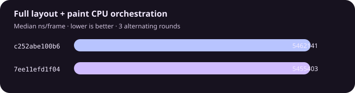

# XenGui performance comparison

Metric: full layout + paint CPU orchestration, release build, identical workload. Lower is better.

| Revision | Median ns/frame |
| --- | ---: |
| `c252abe100b61de46b2301a9ec87740bbdb53724` | 5462141 |
| `7ee11efd1f04eebe04a0eff882b646c9c2b1a63f` | 5455403 |

Change: **-0.12%**. Regression budget: **10%**. Result is the median of 3 alternating process runs per revision.
